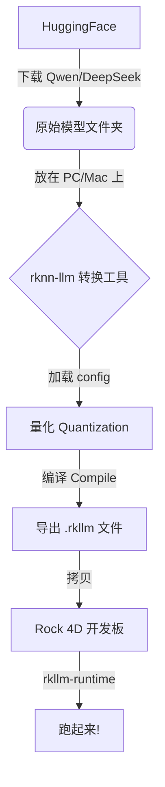

# RK3576 模型转换终极指南 (The Missing Manual)

## 0. 为什么需要转换？(核心概念)

你在 HuggingFace 下载的模型（如 `.safetensors` 或 `.bin`）是为 **Nvidia GPU** 设计的。它们通常是 FP16 (16位浮点) 格式。

RK3576 的 NPU (神经网络处理器) 就像一个只会做特定数学题的"偏科天才"。它：
1.  **看不懂** 通用的 `.safetensors` 文件。
2.  **不喜欢** FP16 (虽然支持，但慢)。它最擅长 **INT8** (8位整数) 或 **INT4** (4位整数)。

**"转换" (Conversion) = 翻译 + 压缩**
-   **翻译**: 把通用的模型结构翻译成 NPU 能理解的私有指令集。
-   **压缩**: 把 16位的小数变成 4位/8位的整数 (量化)，以便塞进 8GB 内存并跑得飞快。

---

## 1. 哪里进行转换？(最大的坑)

**❌ 错误做法**: 在 Rock 4D 开发板上直接转换。
-   **原因**: 转换工具 `rknn-toolkit2` / `rknn-llm` 需要极大的内存 (32GB+) 和 x86 架构指令集。开发板是 ARM 架构且内存小，跑不起来。

**✅ 正确做法**: 在一台性能较强的电脑上转换。
-   **PC (Windows/Linux)**: 使用 WSL2 或原生 Linux。
-   **Mac (Intel/M-Series)**: 使用 Docker 容器 (最推荐)。
-   **云服务器**: 租一台 4090 或大内存 CPU 实例。

---

## 2. 转换流程图 (Step-by-Step)



---

## 3. 实战：在 Mac/PC 上使用 Docker 转换

这是最稳妥的方法，不污染本机环境。

### 第一步：准备 Docker 环境
确保你安装了 Docker Desktop。然后拉取 Rockchip 官方提供的转换镜像（或者自己构建，这里假设使用官方/社区镜像）：

```bash
# 这是一个示例镜像名，请去 rknn-llm 仓库找最新的 tag
docker pull airockchip/rknn-llm:v1.2.3
```

### 第二步：准备转换脚本 `convert.py`
在你的电脑上新建一个文件夹 `converter/`，放入以下 Python 脚本：

```python
from rkllm.api import RKLLM

# 1. 初始化
model = RKLLM()

# 2. 加载 HuggingFace 模型 (假设你已经下载到了 ./Qwen2.5-1.5B-Instruct)
# model_path 必须指向包含 config.json 和 .safetensors 的文件夹
ret = model.load_huggingface(model_path='/data/Qwen2.5-1.5B-Instruct')
if ret != 0:
    print('Load failed!')
    exit(ret)

# 3. 构建 (关键步骤)
# target_platform: 必须是 'rk3576'
# quantized_dtype: 'w4a16' (推荐) 或 'w8a8'
# optimization_level: 1 开启图优化
ret = model.build(
    do_quantization=True,
    optimization_level=1,
    quantized_dtype='w4a16',
    target_platform='rk3576',
    num_npu_core=2  # RK3576 只有 2 个核心，显式指定
)
if ret != 0:
    print('Build failed!')
    exit(ret)

# 4. 导出
ret = model.export_rkllm('/data/qwen-1.5b.rkllm')
if ret != 0:
    print('Export failed!')
    exit(ret)

print("✅ 转换成功！生成的 .rkllm 文件在当前目录。")
```

### 第三步：运行转换
把下载好的模型文件夹也放在 `converter/` 里，然后启动 Docker：

```bash
# 进入 converter 目录
cd converter

# 运行容器，把当前目录挂载到容器内的 /data
docker run --rm -it -v $(pwd):/data airockchip/rknn-llm:v1.2.3 python3 /data/convert.py
```

### 第四步：等待
-   这个过程可能需要 10-30 分钟，取决于你的电脑 CPU 性能。
-   你会看到大量日志滚动，最终生成 `qwen-1.5b.rkllm`。

---

## 4. 常见问题 (FAQ)

**Q: 我可以直接下载别人转好的吗？**
A: **强烈推荐！** 去 [HuggingFace](https://huggingface.co/) 搜索 "rk3576" 或 "rkllm"，或者去 Rockchip 的官方 Model Zoo。如果是标准模型 (Qwen, Llama, Phi)，通常都能找到现成的。自己转换主要是为了微调过的私有模型。

**Q: W4A16 和 W8A8 选哪个？**
-   **W4A16**: 权重 4-bit，激活 16-bit。**省内存** (模型体积减半)，精度损失极小。**推荐用于 8GB 内存板子跑 1.5B - 3B 模型**。
-   **W8A8**: 权重 8-bit，激活 8-bit。**速度最快**，但模型体积大。推荐用于极小模型 (0.5B) 或追求极致速度的场景。

**Q: 转换时报错 "OOM" (Out of Memory)？**
A: 转换工具非常吃内存。转换 7B 模型可能需要 32GB+ 内存。如果你的电脑内存不够，建议租用云服务器或者增加 swap。

**Q: 为什么生成的 `.rkllm` 在板子上报错 "Invalid RKLLM File"？**
A: **版本不匹配**。
-   转换工具 (Toolkit) 版本必须 <= 板子上的运行时 (Runtime) 版本。
-   比如：你用 v1.2.3 转换的模型，不能在 v1.0.0 的旧驱动上跑。**始终保持两端都是最新版。**
